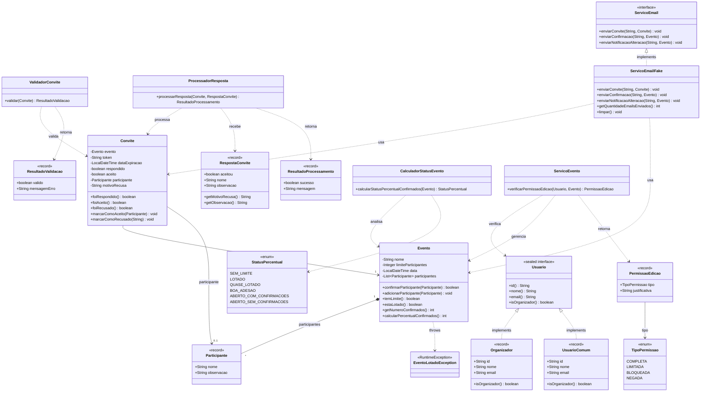

# 🎉 Aplicação de Gerenciamento de Eventos - Bootcamp QA

Aplicação Java desenvolvida seguindo **TDD (Test-Driven Development)** para demonstrar técnicas de teste de software aplicadas em um sistema de gerenciamento de eventos.

## 📋 Descrição do Projeto

Sistema de gerenciamento de eventos que permite criar eventos, enviar convites, confirmar participações e gerenciar permissões de edição. O projeto foi desenvolvido com foco em **qualidade de software**, implementando três técnicas fundamentais de teste:

1. **Análise de Valor Limite (Boundary Testing)**
2. **Tabela de Decisão (Decision Table)**
3. **Fluxo de Controle / Testes Estruturais (Caixa Branca)**

## 🛠️ Tecnologias Utilizadas

- **Java 21**
- **Maven 3.11.0**
- **JUnit 5.10.1** - Framework de testes
- **AssertJ 3.24.2** - Asserções fluentes para testes

## 🏗️ Arquitetura e POO

O projeto demonstra conceitos avançados de Programação Orientada a Objetos:

- ✅ **Classes** (`Evento`, `Convite`, `ProcessadorResposta`, etc.)
- ✅ **Interfaces Seladas** (`Usuario` — sealed interface)
- ✅ **Records** (`Organizador`, `UsuarioComum`, `Participante`, `RespostaConvite`, `ResultadoValidacao`, `ResultadoProcessamento`, `PermissaoEdicao`)
- ✅ **Enums** (`StatusPercentual`, `TipoPermissao`)
- ✅ **Exceptions Customizadas** (`EventoLotadoException`)
- ✅ **Interfaces** (`ServicoEmail`)

### Estrutura de Pacotes

```
src/main/java/com/bootcamp/eventos/
├── dominio/              # Entidades principais
│   ├── Evento.java
│   ├── Convite.java
│   ├── Participante.java (record)
│   ├── RespostaConvite.java (record)
│   ├── Usuario.java (sealed interface)
│   ├── Organizador.java (record)
│   ├── UsuarioComum.java (record)
│   └── enums/
│       ├── StatusPercentual.java
│       └── TipoPermissao.java
├── servico/             # Serviços de negócio
│   ├── ValidadorConvite.java
│   ├── ProcessadorResposta.java
│   ├── CalculadorStatusEvento.java
│   ├── ServicoEvento.java
│   └── email/
│       ├── ServicoEmail.java (interface)
│       └── ServicoEmailFake.java
├── dto/                 # Data Transfer Objects
│   ├── ResultadoValidacao.java (record)
│   ├── ResultadoProcessamento.java (record)
│   └── PermissaoEdicao.java (record)
└── exception/           # Exceções customizadas
    └── EventoLotadoException.java

src/test/java/com/bootcamp/eventos/
├── boundary/            # Testes de Valor Limite
│   └── EventoBoundaryTest.java
├── decisiontable/       # Testes de Tabela de Decisão
│   ├── ValidadorConviteTest.java
│   └── ServicoEventoTest.java
└── controlflow/         # Testes de Fluxo de Controle
    ├── ProcessadorRespostaTest.java
    └── CalculadorStatusEventoTest.java
```

### Diagrama de Classes



## 🧪 Técnicas de Teste Implementadas

### 1. Análise de Valor Limite (Boundary Testing)

**Classe Testada:** `Evento`  
**Testes:** 8 casos de teste  
**Foco:** Limites de participantes e validação de data

```java
// Exemplos de pontos testados:
- on-point: 99 participantes (quase no limite de 100)
- on-point: 100 participantes (exatamente  no limite)
- off-point: 101 participantes (acima do limite - deve lançar exceção)
- Data no passado (off-point)
- Data hoje (on-point)
- Data futura (in-point)
```

**Execução:**

```bash
mvn test -Dtest=EventoBoundaryTest
```

### 2. Tabela de Decisão (Decision Table)

#### ValidadorConvite

**Testes:** 6 casos parametrizados  
**Condições:** Token válido, Token expirado, Evento futuro, Vagas disponíveis

| Regra | Token Válido | Token Expirado | Evento Futuro | Tem Vagas | Resultado   |
| ----- | ------------ | -------------- | ------------- | --------- | ----------- |
| R1    | ✓            | ✗              | ✓             | ✓         | ✅ Permite  |
| R2    | ✓            | ✗              | ✓             | ✗         | ❌ Lotado   |
| R3    | ✓            | ✓              | ✓             | ✓         | ❌ Expirado |
| R5    | ✗            | -              | -             | -         | ❌ Inválido |

**Execução:**

```bash
mvn test -Dtest=ValidadorConviteTest
```

#### ServicoEvento

**Testes:** 4 casos parametrizados  
**Condições:** É organizador, Evento futuro, Tem confirmados

**Execução:**

```bash
mvn test -Dtest=ServicoEventoTest
```

### 3. Fluxo de Controle (Caixa Branca)

#### ProcessadorResposta

**Testes:** 7 casos de teste  
**Cobertura:** 100% branch coverage

**Branches testados:**

- ✓ Convite nulo / Resposta nula
- ✓ Convite já respondido
- ✓ Aceitação com vagas disponíveis
- ✓ Aceitação sem vagas (evento lotado)
- ✓ Aceitação em evento sem limite
- ✓ Recusa de participante

**Execução:**

```bash
mvn test -Dtest=ProcessadorRespostaTest
```

#### CalculadorStatusEvento

**Testes:** 6 casos de teste  
**Cobertura:** 100% branch coverage

**Branches testados:**

- ✓ Evento sem limite
- ✓ 100% ocupado (lotado)
- ✓ 80-99% ocupado (quase lotado)
- ✓ 50-79% ocupado (boa adesão)
- ✓ 1-49% ocupado (aberto com confirmações)
- ✓ 0% ocupado (aberto sem confirmações)

**Execução:**

```bash
mvn test -Dtest=CalculadorStatusEventoTest
```

## 🚀 Como Executar

### Pré-requisitos

- Java 21+
- Maven 3.8+

### Compilar o Projeto

```bash
mvn clean compile
```

### Executar Todos os Testes

```bash
mvn test
```

**Resultado esperado:**

```
Tests run: 31, Failures: 0, Errors: 0, Skipped: 0
```

### Executar Testes Específicos

```bash
# Testes de Boundary
mvn test -Dtest=EventoBoundaryTest

# Testes de Decision Table
mvn test -Dtest=ValidadorConviteTest,ServicoEventoTest

# Testes de Control Flow
mvn test -Dtest=ProcessadorRespostaTest,CalculadorStatusEventoTest
```

## 📊 Resumo dos Testes

| Técnica              | Classe Testada             | Quantidade    | Status      |
| -------------------- | -------------------------- | ------------- | ----------- |
| **Boundary Testing** | EventoBoundaryTest         | 8 testes      | ✅ 100%     |
| **Decision Table**   | ValidadorConviteTest       | 6 testes      | ✅ 100%     |
| **Decision Table**   | ServicoEventoTest          | 4 testes      | ✅ 100%     |
| **Control Flow**     | ProcessadorRespostaTest    | 7 testes      | ✅ 100%     |
| **Control Flow**     | CalculadorStatusEventoTest | 6 testes      | ✅ 100%     |
| **TOTAL**            | -                          | **31 testes** | ✅ **100%** |

## 🎯 Serviços Simulados (Fake)

O projeto implementa o padrão **Fake** para simular integrações externas:

### ServicoEmailFake

Simula envio de emails sem dependências externas:

- ✅ Armazena emails enviados em memória
- ✅ Permite verificação nos testes
- ✅ Logging no console para debug

```java
ServicoEmailFake servicoEmail = new ServicoEmailFake();
servicoEmail.enviarConvite("usuario@example.com", convite);
System.out.println("Emails enviados: " + servicoEmail.getQuantidadeEmailsEnviados());
```

## 📝 Metodologia TDD

Todo o projeto foi desenvolvido seguindo o ciclo **Red-Green-Refactor**:

1. **🔴 RED**: Escrever teste que falha
2. **🟢 GREEN**: Implementar código mínimo para passar
3. **🔵 REFACTOR**: Melhorar código mantendo testes verdes
4. **✅ COMMIT**: Commit semântico em português

## 📄 Licença

Este projeto foi desenvolvido para fins educacionais como parte do Bootcamp Quality Assurance..

---

**🎓 Conceitos Demonstrados:**

- ✅ POO (Sealed Interfaces, Records, Enums, Herança)
- ✅ TDD (Test-Driven Development)
- ✅ Boundary Testing (Análise de Valor Limite)
- ✅ Decision Table Testing (Tabela de Decisão)
- ✅ Control Flow Testing (Fluxo de Controle / Caixa Branca)
- ✅ Fake Objects (Objetos Simulados)
- ✅ Git com Commits Semânticos
- ✅ Maven & JUnit 5
- ✅ AssertJ (Asserções Fluentes)

## 👨‍💻 Autor

**Diogo Mascarenhas Ferreira Santos**  
Bootcamp Quality Assurance
